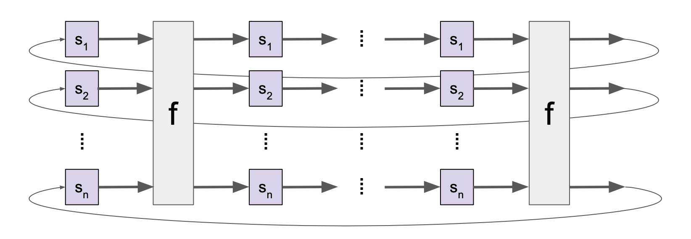

There is one implicit complexity in the design of state machines:

$$
\textbf{State machines should have a cyclical nature.}
$$

This means the description (in terms of constraints) of a state machine is not correct if the appropriate constraints are not satisfied in every row transition. In particular, this should remain true in the transition from the last row to the first row. This is an important aspect that has to be taken care of when designing the set of constraints of a state machine.

If there is some constraint that is not satisfied in the last transition, one normally overcomes this problem by adding artificial values in latter evaluations of some polynomials.

For example, consider the following state machine with its respective computational trace.

Clearly, the constraint $b' = b+a$ is not satisfied in the last transition: $(a,b) = (1,2)$ to $(a,b) = (1,1)$.

This can be solved by appending two extra rows. Below figure shows how this can be performed in the previous example:

Another option would be the introduction of a selector:

As it can be seen in the above code excerpt, now the cost of adding extra rows has been substituted by the addition of the selector $\texttt{SEL}$.

A third option (when possible) is taking advantage of some existing selectors to accommodate latter values.
