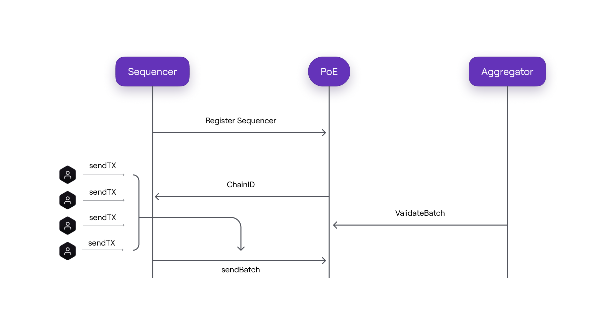

In zk-Rollups, the challenge of decentralizing is huge and it has been difficult to find a good solution so far. This happens because protocols such as PoS have some issues on L2 and there’s a need to get production of zero-knowledge validity proofs (which are very computation intensive for the prover) with high performance so the network can keep its service level.

The earlier **Proof of Donation (PoD)** mechanism was based on a decentralized auction model to get the right to produce batches in a specific timeframe. In this mechanism, the economic incentives were set up so the validators need to be very efficient in order to be competitive.

The latest version of our **Consensus Contract (deployed on Layer 1)** leverages the experience of the existing PoD in v1.0 and adds support for the permissionless participation of multiple coordinators to produce batches in L2.

## Consensus Contract Model

The **Consensus Contract** model leverages the existing PoD mechanism and supports the permissionless participation of multiple coordinators to produce batches in Layer L2. These batches are created from the rolled-up transactions of Layer 1. The **Consensus Contract (PolygonZkEVM.sol)** employs a simpler technique and is favoured due to its greater efficiency in resolving the challenges involved in PoD.  

The strategic implementation of the contract-based consensus promises to ensure that the network: 

- Maintains its **Permissionless** feature to produce L2 batches 
- Is **highly efficient**, a criterion which is key for the overall network performance
- Attains an **acceptable degree of decentralization**
- Is **protected from malicious attacks**, especially by validators
- Maintains a fair balance between overall validation effort and network value

:::tip Good to Know

Possibilities of coupling the Consensus Contract (previously called Proof of Efficiency or PoE) with a PoS (Proof of Stake) are currently being explored. A detailed description is published on the [<ins>Ethereum Research</ins>](https://ethresear.ch/t/proof-of-efficiency-a-new-consensus-mechanism-for-zk-rollups/11988) website.

:::

## On-Chain Data Availability

A **Full ZK-Rollup** schema requires the publication of both **the data** (which users need to reconstruct the full state) and **the validity proofs** (zero-knowledge proofs) on-chain. However, given the Ethereum configuration, publishing data on-chain incurs gas prices, which is an issue with Layer 1. This makes deciding between a Full ZK-Rollup configuration and a Hybrid configuration challenging.

Under a Hybrid schema, either of the following is possible:

 - **Validium**: Data is stored off-chain and only the validity proofs are published on-chain.
 - **Volition**: For some transactions, both the data and the validity proofs remain on-chain while for the remaining ones, only proofs go on-chain.

Unless, among other things, the proving module can be highly accelerated to mitigate costs for the validators, a Hybrid schema remains viable.

## Our Consensus Smart Contract

The underlying protocol in zkEVM ensures that the state transitions are correct by employing a validity proof. To ensure that a set of pre-determined rules have been followed for allowing state transitions, the **Consensus Contract** (deployed on L1) is utilized.

:::info

The **Consensus Contract** is currently deployed on the Goerli testnet. It is available [<ins>here</ins>](https://goerli.etherscan.io/address/0x5e2e663A39205348cE985Bccc9673Ca25AeE727E).

:::

A smart contract verifies the validity proofs to ensure that each transition is completed correctly. This is accomplished by employing zk-SNARK circuits. A system of this type requires two processes: **transaction batching** and **transaction validation**.

To carry out these procedures, zkEVM employs two sorts of participants: **Sequencers** and **Aggregators**. Under this two-layer model: 

- [**Sequencers**](/zkEVM/zknode/overview.md#sequencers) &rarr; propose transaction batches to the network, i.e. they roll-up the transaction requests in batches and add them to the PoE Smart Contract.

- [**Aggregators**](/zkEVM/zknode/overview.md#aggregators) &rarr; check the validity of the transaction batches and provide validity proofs. Any permissionless Aggregator can submit the proof to demonstrate the correctness of the state transition computation.

The  Smart Contract, therefore, makes two calls: One to receive batches from Sequencers, and another to Aggregators, requesting batches to be validated.

## Tokenomics

The Consensus Smart Contract imposes the following requirements on Sequencers and Aggregators:

### Sequencers

- Anyone with the software necessary for running a zkEVM node can be a Sequencer. 
- Every Sequencer must pay a fee in form of MATIC tokens to earn the right to create and propose batches. 
- A Sequencer that proposes valid batches (which consist of valid transactions), is incentivised with the fee paid by transaction-requestors or the users of the network. 

### Aggregators

An Aggregator receives all the transaction information from the Sequencer and sends it to the Prover which provides a small zk-Proof after complex polynomial computations. The smart contract validates this proof. This way, an aggregator collects the data, sends it to the Prover, receives its output and finally, sends the information to the smart contract to check that the validity proof from the Prover is correct. 

- An Aggregator's task is to provide validity proofs for the L2 transactions proposed by Sequencers.
- In addition to running zkEVM's zkNode software, Aggregators need to have specialised hardware for creating the zero-knowledge validity proofs utilizing zkProver.
- For a given batch or batches, an Aggregator that submits a validity proof first earns the MATIC fee (which is being paid by the Sequencer(s) of the batch(es)).
- The Aggregators need to indicate their intention to validate transactions. After that, they compete to produce validity proofs based on their own strategy.
